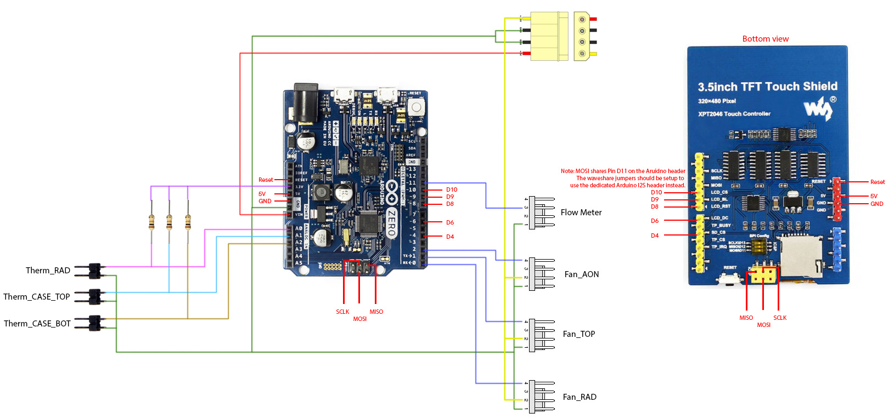

Hardware
==================================

This project is based on the Arduino platform with specific hardware requirements. Altering the hardware will require corresponding adjustment to the firmware. 

Controller Hardware
-------------------

This project is written for the ATSAMD21 ARM Cortex M0+ using Arduino. It will require a compatible board, or an ATSAMD21 microcontroller with the Arduino platform pre-flashed. Some examples include:
- [Arduino Zero](https://store.arduino.cc/genuino-zero)
- [Sparkfun SAMD21 Dev](https://www.sparkfun.com/products/13672)
- [Avdweb's pre-flashed ATSAMD21 chips](https://www.avdweb.nl/arduino/samd21/sam-d21)

The display hardware is a 3.5" 480x320 LCD display from [Waveshare](https://www.waveshare.com/product/oleds-lcds/arduino-lcd/3.5inch-tft-touch-shield.htm). Alternative displays can be used but doing so will require re-writing the display code.

This control unit *requires* the use of an SD card as the ATSAMD21 has no internal writable flash. The Waveshare display above includes an SD card socket which shares the SPI bus with the display and has a separate Chip Select line connected to the Arduino. If a different display is used an SD card will need to be added to the project. 

Additional items required:
- Fan headers for fans as required (3 channels are provided) 
- Fan headers for flow meter input
- 2 pin headers for Thermistor inputs
- 1x 10k precision resistor per Thermistor input
- Molex power connector *See Below*

Some electronics knowledge will be required for assembly. The Waveshare LCD consumes all the Arduino headers and as such some soldering or other wiring work will be required to add fan outputs and flow / temperature inputs to this controller.

Power Supply
------------

This controller requires multiple voltages from the PC powersupply. 
- 12V  - Required for fans. 
- 5V   - Required for LCD Display / Arduino Powersupply*
- 3.3V - Required for microcontroller / SD Card / Thermistors / and Fan PWM signals

The Arduino Zero board similar boards from Sparkfun include onboard 3.3V regulators capable of powering all 3.3V parts in the controller. If a compatible board is used than this project can be powered from a standard computer Molex connector providing 12V and 5V supplies. 

If designing a custom circuit based around the ATSAMD21 it is possible to forgo the 3.3V regulator and power the 3.3V devices directly from the a standard computer SATA-Power connector. 

Hookup Diagram / Schematic
--------------------------

A complete schematic is available [here](Schematic%20Prints.pdf)

An Arduino hookup is also available
 
