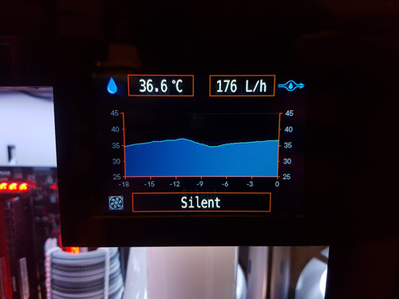
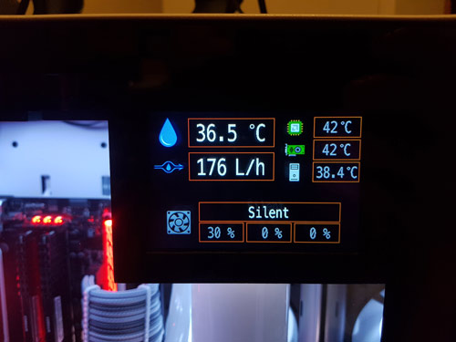
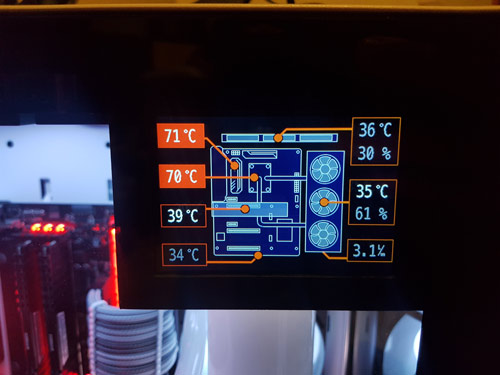

Arduino Watercooler Fan Controller
==================================

This project aims to provide a customisable temperature control unit for a typical watercooled computer. It is based on popular Arduino platform, specifically ARM M0+ micro controllers, and a commonly available LCD display. 

Overview
--------

#### Why Do I need this? ####
Watercooling a PC results in using an intermediate medium to carry heat from a CPU or GPU to a radiator. As with traditional heat sinks temperature is regulated by controlling fan speed on the radiator. This becomes a problem when multiple heat sources exist in the same loop. If fan speed is regulated by CPU temperature then a GPU heavy game could cause the cooling water temperature to raise to undesired levels. Likewise if fan speed is regulated by GPU temperatures then performing CPU heavy tasks will cause a similar temperature rise.

To correctly control temperatures in such a system it is necessary to control not the temperature of the CPU or GPU, but rather the temperature of the cooling water. This Arduino based project aims to do precisely this. 

#### Features ####
The following are some of the features of this Fan Control unit:
- 3 temperature inputs (one control, two indication)
- 1 water flow input (for alarm purposes)
- 3 fan outputs
- 3 fan curves (linear 2-point curves only with adjustable hysteresis)
- Default configuration allows controlling from one temperature sensor
- USB interface to PC (USB-Serial)
- Settings stored on MicroSD card
- Alarm settings on all temperatures with automatic increase in fan speeds

- Graphical LCD display
- 3 graphical interfaces
  - System graphical overview showing all component temperatures
  - Critical information overview showing current operating mode and alarm state
  - History Graph of water temperature showing operating mode, temperature and flow
 
- Computer software interface written in C#
- Interfaces with Libre Hardware Monitor (Open Hardware Monitor fork) to read system information
- Transmits system variables to Fan Controller for display and alarm control
- Read and write all settings
- History Graph of vital data.
- Writes output to temporary file for reading in other software.
- Rainmeter skin to display waterloop status on desktop. 

Repository Contents
-------------------
- */Firmware* - Code for Arudino platform and Documentation
- */Graphics* - Bitmap graphics used by the Fan Controller
- */Hardware* - Parts list, hookup diagram, and custom schematic for the curious
- */Software* - Windows Software and Documentation, and Rainmeter skin

Getting Started
---------------
#### Important note: ####
*I am not a professional programmer.* The software and firmware setup is specific to the system for which the unit was built. You *WILL* require a basic understanding of electronics (connecting an Arduino and some wires), and basic understanding of C and/or C# programming to make this suit your system. 

#### Wait? No Binaries? ####
No. The odds of this working on your system without some modification of code are very slim.
The following are some of the things which you may need / want to customise. Items in italic are computer specific and will need to be changed or an error will be shown:
- Graphics
  - Motherboard schematic graphic
  - Location and choice of sensors
  - Icons / colour scheme
- Hardware / Firmware
  - Alarm functionality
  - Modify control for fans to work on different temperature inputs
- Software
  - *Libre Hardware Monitor lookup array for system temperatures*

#### Hardware ####
This unit will require a compatible micro controller (ARM M0 based Arduino or similar), a compatible display, a microSD card reader if not included in the display, and some wiring for fans. The unit will require 5V and 12V (from a Molex connector) and may require the addition of 3.3V (SATA connector) if the micro controller board does not already include an on board regulator.

#### Firmware ####
This unit is based on Arduino. While it will compile and load with the Arudino IDE it is recommended instead to use the more powerful and programmer friendly PlatformIO. 

#### Software ####
The computer interface is written in C#. To use the computer interface, specifically to read CPU and GPU temperatures a C# IDE with debugger will be required as a specific array value will need to be selected to read CPU and GPU temperatures. By default the software will output 0 for these if they are not customised. 

#### Detailed information on getting started with each sub component is available in each of the subfolders of this repository. ####

